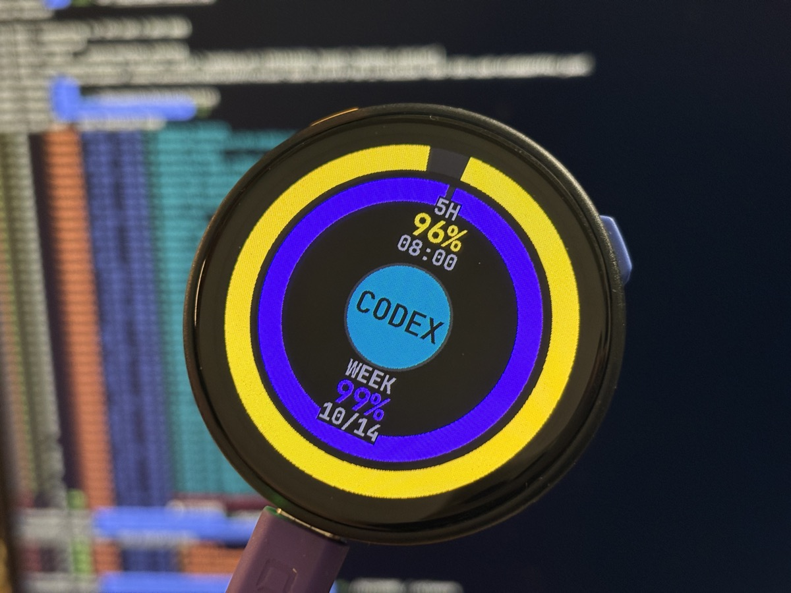
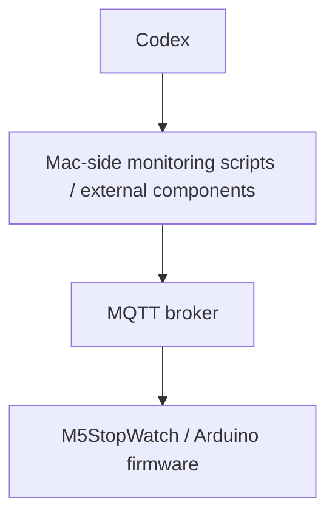

[English](README.md)

# M5StopWatch Codex Monitor

## 1. プロジェクト概要

M5Stack M5StopWatchを使い、MQTTで受信したCodexの使用量とタスク状態を表示するArduinoプロジェクトです。デバイスは購読側であり、Codexへの問い合わせやCodex認証情報の読み取りは行いません。本書は現在のスケッチとローカル設定を根拠に記述し、外部監視コンポーネントの説明を区別しています。

## 2. 機能

- 5時間枠・週間枠の残量を2つの円形ゲージで表示。割合は0〜100%に制限。
- 5時間枠のリセット時刻と週間枠のリセット日を日本標準時で表示。
- 中央のタスク状態表示、DONE振動通知、使用量データのSTALE表示。
- Wi-Fi・MQTT再接続と、MQTT接続成功後の2トピック購読。
- NTP設定と、同梱のJetBrains Mono Nerd Fontビットマップヘッダー。
- 現在の設定では115200 baudのシリアル診断ログ。

## 3. UI / 表示レイアウト

画面回転は0、中心は固定座標`(233, 233)`です。背景は黒、非アクティブなリングは暗色です。

| 要素 | 表示・情報 |
| --- | --- |
| 外側リング | 5時間枠の残量。Pikachu Yellow系（`0xFEA5`）。半径205、幅パラメーター30 |
| 内側リング | 週間枠の残量。CIO Purple系（`0x8AFF`）。半径163、幅パラメーター28 |
| 上側の情報 | `5H`、残量%、リセット時刻`HH:MM` |
| 下側の情報 | `WEEK`、残量%、リセット日`MM/DD` |
| 中央円 | 半径68、縁の幅4ピクセル。タスク状態またはSTALE警告 |

円弧のコードは270度（12時方向）から時計回りに描画します。0%では下地のみ、100%では全周が有効色です。リセットタイムスタンプが未設定または0以下なら`--:--`、`--/--`を表示します。

文字は同梱の`JetBrainsMonoNLNerdFontMono_Bold` 14pt・20pt GFXフォントです。ヘッダーに含まれる文字範囲はASCIIの`0x20`〜`0x7E`であり、Nerd Font全体のアイコンや日本語グリフは含まれません。

## 4. 状態一覧

受信する状態文字列は小文字で、大文字・小文字を区別します。

| MQTT `status` | 内部状態 | 中央ラベル | 色 |
| --- | --- | --- | --- |
| `idle` | IDLE | `CODEX` | Omarchy Cyan系（`0x2C73`） |
| `working` | WORKING | `WORK` | 赤（`0xF800`） |
| `done` | DONE | `DONE` | 青（`0x249F`） |
| その他・未指定 | UNKNOWN | `UNKNOWN` | 灰色（`0x4208`） |

状態未受信で使用量が新鮮な場合はシアンの`CODEX`を表示します。起動直後は`CODEX` / `WAITING`です。使用量がSTALEの場合、タスク状態より優先してオレンジ（`0xFD20`）の`STALE` / `CODEX`を表示します。初回使用量より先に状態を受信した場合も、このSTALE表示になります。APPROVAL検出は未実装です。

## 5. システム構成



ファームウェアは`WiFiClient`と`PubSubClient`でブローカーのメッセージを受信します。Mac側スクリプトを実行する機能はありません。

以下はリポジトリに実ファイルがない**external component（外部コンポーネント）**です。説明は運用者から提供された情報であり、スクリプトのソースから独立に検証したものではありません。

- `codex-usage.py`：Codexの5時間・週間使用量を取得し、`home/codex/usage`へpublish。
- `codex-status.py`：`~/.codex/sessions`以下のJSONLイベントを監視。`task_started`→`working`、`task_complete`→`done`、`turn_aborted`→`idle`に対応させ、`home/codex/status`へretain付きでpublish。DONE後、約10秒でidleへ戻す。
- これらはMacのLaunchAgentとして常駐運用されているとのことです。LaunchAgent定義、設置先、使用量取得・認証方式、監視間隔、実際の送信ペイロードは本リポジトリに含まれません。

## 6. MQTTトピックとペイロード例

| トピック | 用途 | 定義場所 |
| --- | --- | --- |
| `home/codex/usage` | 使用量JSON | `config.h`の`MQTT_TOPIC_USAGE` |
| `home/codex/status` | 状態JSON | スケッチの`MQTT_TOPIC_STATUS` |

ファームウェアのパーサーに対応した使用量の例です。

```json
{
  "updated_at": 1791428400,
  "five_hour": {"remaining_percent": 72, "reset_at": 1791446400},
  "weekly": {"remaining_percent": 48, "reset_at": 1792033200},
  "plan": "example-plan"
}
```

タイムスタンプはUnix秒です。`remaining_percent`は整数として読み、0〜100に制限します。`plan`は保持してログへ出しますが、画面には表示しません。以下の各行はそれぞれ別のMQTTメッセージであり、まとめて1つのJSONとして送るものではありません。

```json
{"status":"idle","event":"turn_aborted"}
{"status":"working","event":"task_started"}
{"status":"done","event":"task_complete"}
```

状態処理で読み取るのは`status`と`event`です。`event`はログと振動条件に使い、表示状態そのものは決めません。不正なJSONは既存状態を置き換えず拒否します。使用量の欠落項目は0（planは空文字）となり、JSON解析に成功すると追加のスキーマ検証なしで使用量を有効にします。追加フィールドは無視します。

MQTTバッファは2048バイトで、トピックやプロトコルのオーバーヘッドもこの容量を使います。購読側は送信側のretainを設定しません。retainされた使用量は購読直後の表示に利用できますが、鮮度はタイムスタンプで判定します。状態のretain付き送信は、提供された外部構成の説明に基づきます。

## 7. 必要なハードウェア

- 内蔵ディスプレイ、Wi-Fi、振動モーターを備えたM5Stack M5StopWatch。
- 書き込み・給電用USB接続と、Arduinoツールチェーンを備えたコンピューター。
- 到達可能なWi-FiネットワークとMQTTブローカー。説明した運用では外部監視コンポーネントを動かすMac。

このスケッチは外付けセンサーや追加配線を参照していません。

## 8. 必要なArduinoライブラリ

| 依存関係 | 用途 |
| --- | --- |
| M5Unified | 初期化、表示、電源・振動制御、`M5.update()` |
| M5GFX | M5Unified経由の表示・フォント処理。必要な依存ライブラリも導入 |
| PubSubClient | MQTTクライアント |
| ArduinoJson 7 | `JsonDocument`とJSON解析 |
| 対応するESP32 Arduinoボードパッケージ | `WiFi.h`、時刻・NTP API、対象ハードウェアのサポート |

`time.h`はツールチェーンが提供します。2つのフォントヘッダーはローカルに同梱され、実行時のフォント取得は不要です。ライブラリ・コアのバージョン固定や、検証済みFQBN・ビルドプロファイルはリポジトリにありません。

## 9. 設定

公開用テンプレートは`config.example.h`です。スケッチと同じ場所に`config.h`としてコピーし、プレースホルダーをローカルのネットワーク設定に置き換えてください。`config.h`はGitで無視されるため、コミットしないでください。

```sh
cp config.example.h config.h
```

テンプレートは既存の`constexpr`宣言に合わせています。ブローカーの認証が必要な場合は`MQTT_USER`と`MQTT_PASSWORD`を設定してください。ユーザー名が空文字なら認証なしの接続オーバーロードを使います。複数台ではクライアントIDをそれぞれ異なる値にしてください。

状態トピック、色、画面配置、振動設定、NTP設定はスケッチ内の定数であり、`config.h`の設定項目ではありません。Wi-Fi・MQTTパスワード、APIトークン、Codex認証情報はドキュメントやコミットへ含めないでください。MQTTは通常の`WiFiClient`を使い、TLSは設定されていません。

## 10. ビルド / 書き込み手順

1. Arduino IDEまたはArduino CLI、対応するESP32ボードパッケージ、上記ライブラリを導入します。
2. 同名のスケッチディレクトリにある`M5STOPWATCH-CodexMonitor.ino`を開きます。フォントヘッダー2つと`config.h`を同じ場所に配置します。
3. `config.example.h`を`config.h`にコピーし、ローカルのWi-Fi・MQTT設定を記入します。
4. 実際のM5StopWatchに対応するボードプロファイルとUSBポートを選びます。正確なボードメニュー、フラッシュ・パーティション設定、FQBNは本リポジトリから確定できないため、使用するハードウェア環境で確認してください。
5. Verify/Compileを実行し、デバイスを書き換える際にUploadを実行します。
6. `SERIAL_BAUD`（現在115200）のシリアルモニターで接続・購読ログを確認し、利用するブローカーのツールで現在のタイムスタンプを持つ例のメッセージを送ります。

正しいFQBNとポートを確認した後に使うCLIの形式例です。

```sh
arduino-cli compile --fqbn <YOUR_FQBN> /path/to/M5STOPWATCH-CodexMonitor
arduino-cli upload --fqbn <YOUR_FQBN> --port <YOUR_USB_PORT> /path/to/M5STOPWATCH-CodexMonitor
```

これらは手順のテンプレートであり、ビルド・書き込み成功の証拠ではありません。今回のドキュメント更新ではファームウェアのビルドや実機への書き込みは行っていません。

## 11. 動作の仕組み

`setup()`でM5Unified、シリアル、待機画面を初期化し、最大15秒間Wi-Fi接続を待ちます。この間に接続できた場合、`configTzTime("JST-9", "ntp.nict.jp", "pool.ntp.org")`を呼びます。その後、MQTTサーバー、コールバック、バッファを設定し、Wi-Fi接続済みなら直ちにMQTT接続を試みます。

`loop()`では`M5.update()`、Wi-Fi・MQTT維持、鮮度変化の確認を実行し、10 ms待ちます。現在の設定では各サービスの未接続時に5秒間隔で再試行します。MQTT接続成功後は2トピックを購読し、接続中は`mqttClient.loop()`で受信処理します。

解析した使用量メッセージは全画面を再描画します。状態変化は中央のみ、fresh/staleの変化は使用量画面全体を再描画します。ボタン操作、ローカルのタスク制御、デバイス側のDONE→IDLEタイマーはありません。

## 12. DONE振動の動作

`handleStatusMessage()`は次の条件がすべて成立したときだけ振動します。

1. 以前の状態メッセージによって有効な状態が確立済み。
2. 直前の状態がDONEではない。
3. 新しい状態がDONE。
4. `event`が正確に`task_complete`。

`vibrateDone()`は強度180に設定し、250 msブロックして待ち、強度0へ戻します。直前の状態がDONEのままなら、DONEの再受信では振動しません。起動後の最初の状態受信は、retainされたDONEを含めて振動しません。使用量がSTALEでも振動判定は無効になりません。

**再接続時の制限：** 切断・再接続で`codexStatusValid`をクリアせず、MQTTのretainフラグも調べていません。そのため、有効な非DONE状態を以前に保持していた場合、再接続後にretainされたDONEと`task_complete`を受信すると振動し得ます。すべての再接続条件での抑制は保証されません。

約10秒後のIDLE復帰は、提供された運用説明では外部のMac側publisherが担当します。ファームウェア側の処理ではありません。後続の状態メッセージがなければDONEを保持し続けます（STALE表示で見えなくなる場合はあります）。

## 13. 古いデータ / STALEの動作

鮮度は受信時刻ではなく、ペイロードの`updated_at`を使います。現在の設定では`now - updated_at > 900`秒、すなわち15分を厳密に超えるとSTALEになります。

- 有効な使用量がない場合、`codexIsStale()`はtrueです。ただし起動時は別の再描画が起きるまで専用の待機画面を表示します。
- Unix時刻が`1700000000`を超える場合だけシステム時刻を有効とみなします。使用量が有効でもシステム時刻が無効なら、経過時間によるSTALE判定は行いません。
- `updated_at`が未来の場合、ローカル時刻が追いつくまでは新鮮とみなします。
- STALEになっても最後のゲージ・残量は残り、中央の警告がタスク状態を置き換えます。
- 状態メッセージは使用量の鮮度を更新せず、状態自体の鮮度タイムアウトもありません。

NTP設定は初回Wi-Fi成功時だけです。初回接続失敗後のWi-Fi復旧でNTPを明示設定する処理、同期完了を待つ処理、NTP成功を検証する処理はありません。

## 14. リポジトリ / ファイル構成

```text
M5STOPWATCH-CodexMonitor/
├── M5STOPWATCH-CodexMonitor.ino
├── config.h                    # local / Git-ignored
├── config.example.h            # public template
├── JetBrainsMonoBold14.h
├── JetBrainsMonoBold20.h
├── assets/
│   └── a.jpeg
├── .gitignore
├── LICENSE
├── README.md
└── README.ja.md
```

`.ino`はUI描画、JSON解析、ネットワーク、鮮度判定、振動処理を含みます。`config.h`は非公開のローカル接続設定、`config.example.h`は公開用テンプレート、フォントヘッダーはPROGMEMのビットマップ・グリフデータを保持します。`.gitignore`はローカル設定や一般的なビルド生成物を除外します。Mac側スクリプト、LaunchAgent定義、ブローカー設定、フォント生成ツール、自動テストは含まれません。

## 15. 既知の制限

- APPROVAL・承認待ちは未検出。未対応の状態はUNKNOWN表示。
- retainされたDONEの抑制は起動後の最初の状態に有効ですが、前述の再接続時の制限があります。
- NTPは前述の起動時のみの設定経路です。鮮度判定は有効な時計とpublisherのタイムスタンプに依存します。
- publisherから更新がなければ状態は無期限に残ります。デバイス側で複数Codexセッションを集約しません。
- JSON検証は解析と既定値処理に限られ、購読結果も確認しません。
- MQTT通信は暗号化されず、接続試行と振動の待ち時間はループ処理をブロックし得ます。
- UI座標とASCIIのみの同梱フォントは固定。ビルド設定の固定や実機検証結果はリポジトリにありません。

## 16. 今後の改善候補

以下は未実装の改善候補です。

- 承認待ち検出とMQTT・UI仕様の定義。
- イベントの鮮度・識別規則による、再接続時のretainされたDONE処理の強化。
- 遅れてWi-Fiが復旧した場合のNTP設定と、同期状態の可視化。
- ペイロード検証、状態独自の鮮度判定、購読失敗への対応。
- 検証済みボード・ビルド設定、依存バージョン、実機動作チェックの記録。
- 認証付きTLS通信の検討と、秘密情報を含めない外部publisher・LaunchAgent設定資料。

## 17. ライセンス

このプロジェクトはMITライセンスで提供します。詳細は[LICENSE](LICENSE)を参照してください。著作権者はomiya-bonsai、著作権年は2026年です。

同梱のビットマップフォントヘッダーは、第三者の制作物であるJetBrains Mono Nerd Fontを基にしています。これらのフォントデータは本リポジトリのMITライセンスの対象外であり、元のフォントに適用されるライセンス条件に従います。
