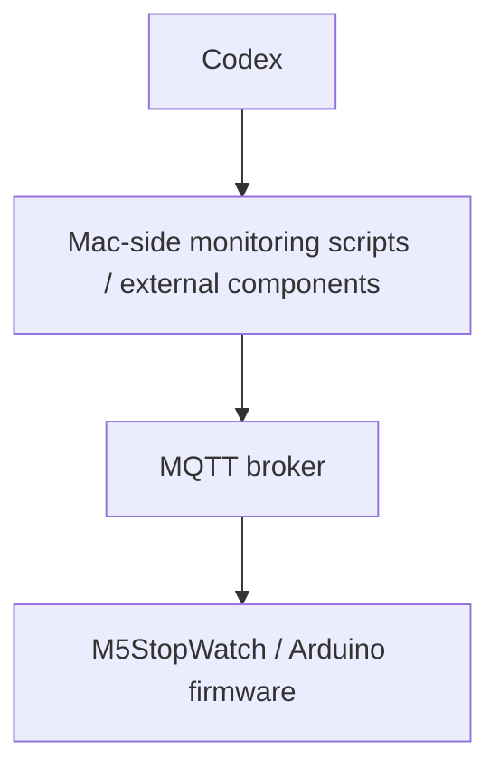

[日本語](README.ja.md)

# M5StopWatch Codex Monitor

## 1. Project overview

An Arduino project that uses an M5Stack M5StopWatch to display Codex usage and task status received over MQTT. The device is a subscriber: it does not query Codex or read Codex credentials. This document describes the current sketch and local configuration; external monitoring behavior is identified separately.

## 2. Features

- Two circular gauges for remaining five-hour and weekly usage, clamped to 0–100%.
- Five-hour reset time and weekly reset date in Japan Standard Time.
- Central task status, DONE vibration, and stale-usage indication.
- Wi-Fi and MQTT reconnection, with two topic subscriptions after each successful MQTT connection.
- NTP configuration and bundled JetBrains Mono Nerd Font bitmap headers.
- Serial diagnostics at 115200 baud with the current configuration.

## 3. UI / display layout

The sketch uses rotation 0 and fixed coordinates centered at `(233, 233)`, with a black background and dark inactive ring tracks.

| Element | Appearance / information |
| --- | --- |
| Outer ring | Five-hour remaining percentage; Pikachu Yellow (`0xFEA5`); radius 205, width parameter 30 |
| Inner ring | Weekly remaining percentage; CIO Purple (`0x8AFF`); radius 163, width parameter 28 |
| Upper information | `5H`, remaining percentage, reset time `HH:MM` |
| Lower information | `WEEK`, remaining percentage, reset date `MM/DD` |
| Center | Radius 68 with a 4-pixel border; task state or stale warning |

The arc code starts at 270 degrees (12 o'clock) and advances clockwise. Zero leaves only the track; 100 fills the ring. Missing/nonpositive reset timestamps show `--:--` or `--/--`.

Text uses the bundled `JetBrainsMonoNLNerdFontMono_Bold` 14pt and 20pt GFX fonts. These headers contain ASCII characters `0x20`–`0x7E`, not the complete Nerd Font icon set or Japanese glyphs.

## 4. Status states

Incoming status strings are lowercase and case-sensitive.

| MQTT `status` | Internal state | Center label | Color |
| --- | --- | --- | --- |
| `idle` | IDLE | `CODEX` | Omarchy Cyan (`0x2C73`) |
| `working` | WORKING | `WORK` | Red (`0xF800`) |
| `done` | DONE | `DONE` | Blue (`0x249F`) |
| Other / missing | UNKNOWN | `UNKNOWN` | Gray (`0x4208`) |

Before any status is received, fresh usage displays `CODEX` in cyan. Startup initially shows `CODEX` / `WAITING`. Stale usage overrides the center with orange (`0xFD20`) `STALE` / `CODEX`, regardless of task state. A status message before the first usage message also renders this stale center. APPROVAL detection is not implemented.

## 5. System architecture



The firmware consumes broker messages through `WiFiClient` and `PubSubClient`. It never invokes the Mac scripts.

The following are **external components**, absent from this repository. Their descriptions are supplied by the operator and are not independently verified from their source:

- `codex-usage.py`: obtains five-hour and weekly Codex usage and publishes to `home/codex/usage`.
- `codex-status.py`: watches JSONL events under `~/.codex/sessions`; maps `task_started` to `working`, `task_complete` to `done`, and `turn_aborted` to `idle`; publishes retained status to `home/codex/status`; returns DONE to idle after about 10 seconds.
- These scripts are reportedly run as Mac LaunchAgents. LaunchAgent definitions, installation paths, usage acquisition/authentication details, polling intervals, and actual publisher payloads are not included here.

## 6. MQTT topics and payload examples

| Topic | Purpose | Location |
| --- | --- | --- |
| `home/codex/usage` | Usage JSON | `MQTT_TOPIC_USAGE` in `config.h` |
| `home/codex/status` | Status JSON | `MQTT_TOPIC_STATUS` in the sketch |

Illustrative usage payload matching the firmware parser:

```json
{
  "updated_at": 1791428400,
  "five_hour": {"remaining_percent": 72, "reset_at": 1791446400},
  "weekly": {"remaining_percent": 48, "reset_at": 1792033200},
  "plan": "example-plan"
}
```

Timestamps are Unix seconds. `remaining_percent` is read as an integer and clamped to 0–100. `plan` is stored and logged, but not displayed. Each example status below is a separate MQTT message, not one combined JSON document:

```json
{"status":"idle","event":"turn_aborted"}
{"status":"working","event":"task_started"}
{"status":"done","event":"task_complete"}
```

Only `status` and `event` are consumed for status. `event` is logged and gates vibration; it does not determine the displayed state. Invalid JSON is rejected without replacing the existing state. Missing usage fields default to zero (or an empty plan), and successfully parsed JSON marks usage valid without further schema validation. Additional fields are ignored.

The MQTT buffer is configured to 2048 bytes; topic and protocol overhead also consume space. The subscriber does not set publisher retain behavior. Retained usage can populate the screen after subscription, but its timestamp still determines freshness. Retained status publishing is part of the reported external setup.

## 7. Required hardware

- M5Stack M5StopWatch with its built-in display, Wi-Fi, and vibration motor.
- USB connection for programming/power, and a computer with an Arduino toolchain.
- A reachable Wi-Fi network and MQTT broker; a Mac running the external monitoring components for the described deployment.

No external sensor or wiring is referenced by this sketch.

## 8. Required Arduino libraries

| Dependency | Use |
| --- | --- |
| M5Unified | Device initialization, display, power/vibration, `M5.update()` |
| M5GFX | Display/font support used through M5Unified; install its required dependencies |
| PubSubClient | MQTT client |
| ArduinoJson 7 | `JsonDocument` and JSON deserialization |
| Compatible ESP32 Arduino board package | `WiFi.h`, time/NTP APIs and target support |

`time.h` is supplied by the toolchain. The two font headers are included locally; no runtime font download is needed. This repository does not pin library/core versions or provide a verified board FQBN/build profile.

## 9. Configuration

`config.example.h` is the public template. Copy it to `config.h` beside the sketch and replace the placeholders with your local network settings. `config.h` is Git-ignored and must not be committed:

```sh
cp config.example.h config.h
```

The template uses the existing `constexpr` declarations. Set `MQTT_USER` and `MQTT_PASSWORD` if your broker requires authentication; an empty username selects the unauthenticated connection overload. Use a unique client ID for each monitor.

The status topic, colors, geometry, vibration parameters, and NTP settings are constants in the sketch, not options in `config.h`. Never publish Wi-Fi/MQTT passwords, API tokens, or Codex authentication information in documentation or commits. MQTT uses plain `WiFiClient`; TLS is not configured.

## 10. Build / upload procedure

1. Install Arduino IDE or Arduino CLI, a compatible ESP32 board package, and the libraries above.
2. Open `M5STOPWATCH-CodexMonitor.ino` in its matching sketch directory. Keep both font headers and `config.h` beside it.
3. Copy `config.example.h` to `config.h` and set local Wi-Fi/MQTT configuration.
4. Select the board profile and USB port appropriate to the actual M5StopWatch hardware. This repository does not establish an exact board menu selection, flash/partition settings, or FQBN; confirm these with your hardware setup.
5. Run Verify/Compile, then Upload when you intend to program the device.
6. Open Serial Monitor at `SERIAL_BAUD` (currently 115200). Check connection/subscription logs and publish example messages with current timestamps through your own broker tooling.

Optional CLI pattern, after resolving the correct FQBN and port:

```sh
arduino-cli compile --fqbn <YOUR_FQBN> /path/to/M5STOPWATCH-CodexMonitor
arduino-cli upload --fqbn <YOUR_FQBN> --port <YOUR_USB_PORT> /path/to/M5STOPWATCH-CodexMonitor
```

These are procedure templates, not evidence of a successful build or upload. No firmware build or device programming was performed for this documentation update.

## 11. How it works

`setup()` initializes M5Unified, serial and the waiting screen, then attempts Wi-Fi for up to 15 seconds. If Wi-Fi connects during that window, it calls `configTzTime("JST-9", "ntp.nict.jp", "pool.ntp.org")`. It configures MQTT, its callback and buffer, and attempts MQTT immediately if Wi-Fi is connected.

`loop()` calls `M5.update()`, maintains Wi-Fi and MQTT, checks freshness transitions, and delays 10 ms. With the current configuration each disconnected service retries at a 5-second interval. Successful MQTT connections subscribe to both topics; connected clients are serviced with `mqttClient.loop()`.

A parsed usage message redraws the whole screen. A changed status redraws only the center. A fresh/stale transition redraws the whole usage screen. There is no button action, local task control, or device-side DONE-to-IDLE timer.

## 12. DONE vibration behavior

`handleStatusMessage()` vibrates only when all of these are true:

1. A previous status message has already established a valid status.
2. The previous state is not DONE.
3. The new state is DONE.
4. `event` is exactly `task_complete`.

`vibrateDone()` sets strength 180, blocks for 250 ms, then sets strength 0. Repeated DONE messages do not vibrate while the previous state remains DONE. The first status after startup never vibrates, including retained DONE. Stale usage does not disable the vibration decision.

**Reconnect limitation:** the code does not clear `codexStatusValid` on disconnect/reconnect and does not inspect the MQTT retain flag. A retained DONE with `task_complete` can therefore vibrate after reconnection if a valid non-DONE state was previously stored. Suppression is not guaranteed for every reconnect scenario.

Returning to IDLE after about 10 seconds is performed by the reported external Mac publisher, not this firmware. Without a later status message, DONE remains stored (although stale usage can cover it visually).

## 13. Stale-data behavior

Freshness uses payload `updated_at`, not the local reception time. With the current configuration, data becomes stale when `now - updated_at > 900` seconds (strictly greater than 15 minutes).

- No valid usage data: `codexIsStale()` returns true; startup still shows the special waiting screen until another redraw occurs.
- System time is treated as valid only when Unix time exceeds `1700000000`. With valid usage but invalid system time, age-based stale detection is disabled.
- A future `updated_at` is treated as fresh until the local clock catches up.
- Stale data retains the last gauges and percentages; the center warning replaces task status.
- Status messages do not refresh usage or have their own freshness timeout.

NTP configuration occurs only when initial Wi-Fi succeeds. The sketch does not explicitly configure NTP after a later recovery from initial Wi-Fi failure, wait for synchronization, or verify NTP success.

## 14. Repository / file structure

```text
M5STOPWATCH-CodexMonitor/
├── M5STOPWATCH-CodexMonitor.ino
├── config.h                    # local / Git-ignored
├── config.example.h            # public template
├── JetBrainsMonoBold14.h
├── JetBrainsMonoBold20.h
├── assets/
│   └── a.jpeg
├── .gitignore
├── LICENSE
├── README.md
└── README.ja.md
```

The `.ino` contains UI rendering, parsing, networking, freshness and vibration logic. `config.h` holds private local connection settings; `config.example.h` is the public template. The font headers hold bitmap/glyph data in PROGMEM. `.gitignore` excludes local configuration and common build artifacts. Mac scripts, LaunchAgent definitions, broker configuration, font-generation tooling and automated tests are not included.

## 15. Known limitations

- APPROVAL / approval-wait detection is absent; unsupported states display UNKNOWN.
- Retained-DONE suppression is reliable for the first startup status, but has the reconnect limitation described above.
- NTP has the startup-only configuration path described above; usage freshness depends on a valid clock and publisher timestamps.
- Status can remain indefinitely without a new publisher message; the device does not aggregate multiple Codex sessions.
- JSON validation is limited to parsing and default values; subscription results are not checked.
- MQTT transport is unencrypted, and connection attempts and the vibration delay can block loop processing.
- UI coordinates and ASCII-only bundled fonts are fixed; the repository has no pinned build configuration or device-validation results.

## 16. Future work

Potential improvements, not implemented features:

- Add approval-wait detection and a defined MQTT/UI contract.
- Make reconnect-time retained-DONE handling robust through an explicit event freshness/identity policy.
- Configure NTP after delayed Wi-Fi recovery and expose clock synchronization state.
- Add payload validation, independent status freshness, and subscription failure handling.
- Document a verified board/build profile, dependency versions, and hardware behavior checks.
- Consider authenticated TLS transport and document the external publisher/LaunchAgent setup without secrets.

## License

This project is licensed under the MIT License. See [LICENSE](LICENSE). Copyright (c) 2026 omiya-bonsai.

The bundled bitmap font headers are based on JetBrains Mono Nerd Font, a third-party work. They are not covered by this repository's MIT license; the font's original license terms apply.
